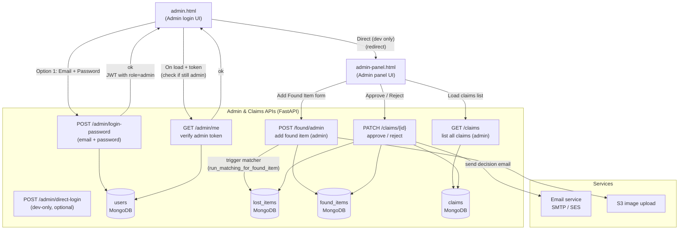
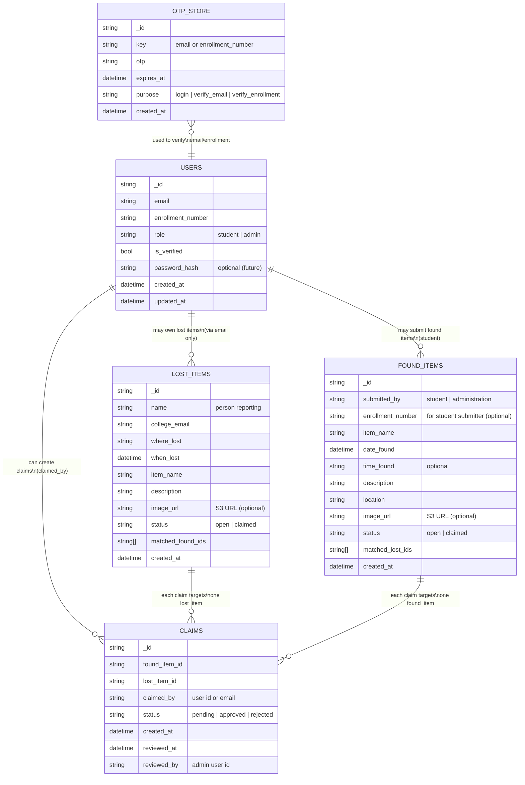

## E Lost & Found – Detailed Workflows

### 1. Student Flows (Lost, Found, Claim)

```mermaid
flowchart TD
  %% Pages
  LostPage["lost.html\n(Student reports LOST)"]
  FoundPage["found.html\n(Student reports FOUND)"]
  ClaimPage["claim.html\n(Student claims match)"]

  %% Backend modules
  subgraph Auth["Auth & Users"]
    A_SendOTP["POST /auth/otp/send\nsend OTP email"]
    A_VerifyOTP["POST /auth/otp/verify\nverify OTP, create/get user, return JWT"]
    UsersDB[("users\nMongoDB")]
  end

  subgraph LostFound["Lost & Found APIs"]
    L_SendOTP["POST /lost/otp/send\nsend OTP to college email"]
    L_VerifyOTP["POST /lost/otp/verify\nverify OTP for lost flow"]
    L_Submit["POST /lost\ncreate lost_items doc"]

    F_SendOTP["POST /found/student/otp/send\nsend OTP to student email"]
    F_VerifyOTP["POST /found/student/otp/verify\nverify OTP for found flow"]
    F_SubmitStudent["POST /found/student\ncreate found_items doc (student)"]
    F_SubmitAdmin["POST /found/admin\ncreate found_items doc (admin)"]

    LostDB[("lost_items\nMongoDB")]
    FoundDB[("found_items\nMongoDB")]
  end

  subgraph Matcher["Matcher & Background Job"]
    M_Lost["run_matching_for_lost_item()\n(for new lost)"]
    M_Found["run_matching_for_found_item()\n(for new found)"]
    Hourly["APScheduler hourly job\nrun_hourly_matching()"]
  end

  subgraph Claims["Claims APIs"]
    C_Create["POST /claims\ncreate pending claim"]
    ClaimsDB[("claims\nMongoDB")]
  end

  subgraph Services["Shared Services"]
    OTPStore[("otp_store\nMongoDB")]
    EmailSvc["Email service\nSMTP or AWS SES"]
    S3Svc["Image upload\nAWS S3 (optional)"]
  end

  Stats["GET /stats\n(homepage counters)"]

  %% Homepage stats
  LostDB --> Stats
  FoundDB --> Stats

  %% LOST FLOW
  LostPage -- 1. Send OTP\n(college_email) --> L_SendOTP
  L_SendOTP --> OTPStore
  L_SendOTP --> EmailSvc

  LostPage -- 2. Verify OTP\n(email + otp) --> L_VerifyOTP
  L_VerifyOTP --> OTPStore
  L_VerifyOTP -- ok --> LostPage

  LostPage -- 3. Submit lost form\n(name, email, where_lost, when_lost, item_name, desc, image?) --> L_Submit
  L_Submit -->|"store doc"| LostDB
  L_Submit -->|"upload image\n(if configured)"| S3Svc

  %% Immediately match new LOST against FOUND
  L_Submit --> M_Lost
  M_Lost -->|"text search\non found_items"| FoundDB
  M_Lost -->|"update matched_found_ids\nand matched_lost_ids"| LostDB
  M_Lost -->|"for each match\nbuild claim URL\nhttp://frontend/claim.html?found_id=&lost_id="| EmailSvc

  %% FOUND (STUDENT) FLOW
  FoundPage -- 1. Send OTP\n(email) --> F_SendOTP
  F_SendOTP --> OTPStore
  F_SendOTP --> EmailSvc

  FoundPage -- 2. Verify OTP\n(email + otp) --> F_VerifyOTP
  F_VerifyOTP --> OTPStore
  F_VerifyOTP -- ok --> FoundPage

  FoundPage -- 3. Submit found form\n(enrollment_number, email, item, date_found, time_found?, desc, location, image?) --> F_SubmitStudent
  F_SubmitStudent -->|"store doc"| FoundDB
  F_SubmitStudent -->|"upload image\n(if configured)"| S3Svc

  %% Immediately match new FOUND against LOST
  F_SubmitStudent --> M_Found
  M_Found -->|"text search\non lost_items"| LostDB
  M_Found -->|"update matched_lost_ids\nand matched_found_ids"| FoundDB
  M_Found -->|"for each match\nbuild claim URL\nhttp://frontend/claim.html?found_id=&lost_id="| EmailSvc

  %% FOUND (ADMIN) FLOW
  F_SubmitAdmin -->|"store doc"| FoundDB
  F_SubmitAdmin --> S3Svc
  F_SubmitAdmin --> M_Found

  %% HOURLY JOB
  Hourly -->|"for each open lost"| M_Lost
  Hourly -->|"for each open found"| M_Found

  %% CLAIM FLOW FROM EMAIL LINK
  EmailSvc -- sends email\nwith claim link --> ClaimPage

  ClaimPage -- 0. Load URL\n?found_id=&lost_id= --> ClaimPage

  %% If not logged in: use generic OTP auth
  ClaimPage -- 1. Send OTP\n(email) --> A_SendOTP
  A_SendOTP --> OTPStore
  A_SendOTP --> EmailSvc

  ClaimPage -- 2. Verify OTP\n(email + otp) --> A_VerifyOTP
  A_VerifyOTP --> OTPStore
  A_VerifyOTP --> UsersDB
  A_VerifyOTP -- returns JWT --> ClaimPage

  %% Submit claim (requires JWT)
  ClaimPage -- 3. Submit claim\n(found_id, lost_id) --> C_Create
  C_Create -->|"store claim\nstatus=pending"| ClaimsDB
  C_Create --> LostDB
  C_Create --> FoundDB
```

---

### 2. Admin Flows (Login, Panel, Claims)

```mermaid
flowchart TD
  %% Admin pages
  AdminLoginPage["admin.html\n(Admin login UI)"]
  AdminPanelPage["admin-panel.html\n(Admin panel UI)"]

  %% Backend admin/auth
  subgraph AdminAPI["Admin & Claims APIs (FastAPI)"]
    A_LoginPwd["POST /admin/login-password\n(email + password)"]
    A_Direct["POST /admin/direct-login\n(dev-only, optional)"]
    A_Me["GET /admin/me\nverify admin token"]
    C_List["GET /claims\nlist all claims (admin)"]
    C_Update["PATCH /claims/{id}\napprove / reject"]
    F_Admin["POST /found/admin\nadd found item (admin)"]

    UsersDB[("users\nMongoDB")]
    LostDB[("lost_items\nMongoDB")]
    FoundDB[("found_items\nMongoDB")]
    ClaimsDB[("claims\nMongoDB")]
  end

  subgraph Services["Services"]
    EmailSvc["Email service\nSMTP / SES"]
    S3Svc["S3 image upload"]
  end

  %% LOGIN FLOW
  AdminLoginPage -- Option 1: Email + Password --> A_LoginPwd
  A_LoginPwd --> UsersDB
  A_LoginPwd -- ok\nJWT with role=admin --> AdminLoginPage

  AdminLoginPage -- On load + token\n(check if still admin) --> A_Me
  A_Me --> UsersDB
  A_Me -- ok --> AdminLoginPage

  %% DIRECT (DEV) FLOW (OPTIONAL)
  AdminLoginPage -- Direct (dev only)\n(redirect) --> AdminPanelPage

  %% ADMIN PANEL ACTIONS (admin-panel.html)
  AdminPanelPage -- Add Found Item form --> F_Admin
  F_Admin --> FoundDB
  F_Admin --> S3Svc
  F_Admin -->|"trigger matcher\n(run_matching_for_found_item)"| LostDB

  %% CLAIM REVIEW
  AdminPanelPage -- Load claims list --> C_List
  C_List --> ClaimsDB

  AdminPanelPage -- Approve / Reject --> C_Update
  C_Update --> ClaimsDB
  C_Update --> LostDB
  C_Update --> FoundDB
  C_Update -- send decision email --> EmailSvc
```

---

### 3. Data Models & Collections

```mermaid
erDiagram
  USERS {
    string _id
    string email
    string enrollment_number
    string role        "student | admin"
    bool   is_verified
    string password_hash "optional (future)"
    datetime created_at
    datetime updated_at
  }

  LOST_ITEMS {
    string _id
    string name            "person reporting"
    string college_email
    string where_lost
    datetime when_lost
    string item_name
    string description
    string image_url       "S3 URL (optional)"
    string status          "open | claimed"
    string[] matched_found_ids
    datetime created_at
  }

  FOUND_ITEMS {
    string _id
    string submitted_by    "student | administration"
    string enrollment_number "for student submitter (optional)"
    string item_name
    datetime date_found
    string time_found      "optional"
    string description
    string location
    string image_url       "S3 URL (optional)"
    string status          "open | claimed"
    string[] matched_lost_ids
    datetime created_at
  }

  CLAIMS {
    string _id
    string found_item_id
    string lost_item_id
    string claimed_by      "user id or email"
    string status          "pending | approved | rejected"
    datetime created_at
    datetime reviewed_at
    string reviewed_by     "admin user id"
  }

  OTP_STORE {
    string _id
    string key             "email or enrollment_number"
    string otp
    datetime expires_at
    string purpose         "login | verify_email | verify_enrollment"
    datetime created_at
  }

  %% Relationships

  USERS ||--o{ CLAIMS : "can create claims\n(claimed_by)"
  LOST_ITEMS ||--o{ CLAIMS : "each claim targets\none lost_item"
  FOUND_ITEMS ||--o{ CLAIMS : "each claim targets\none found_item"

  USERS ||--o{ FOUND_ITEMS : "may submit found items\n(student)"
  USERS ||--o{ LOST_ITEMS : "may own lost items\n(via email only)"

  OTP_STORE }o--|| USERS : "used to verify\nemail/enrollment"
```

